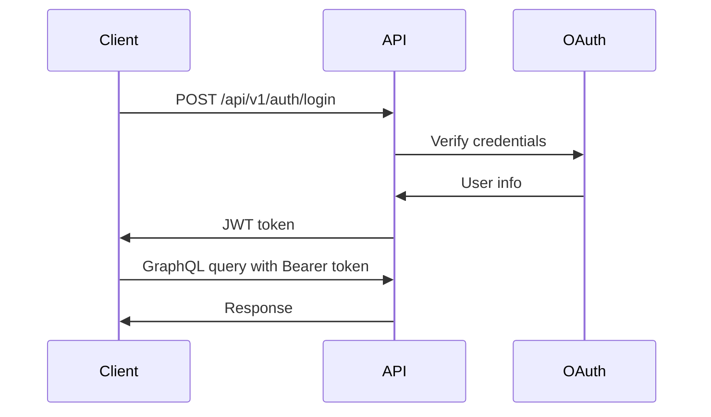

# 🔌 API仕様書

## 📋 API概要

Morrow APIは、イベントカウントダウン共有アプリケーションのためのGraphQLベースのAPIです。RESTful エンドポイントも一部提供しています。

## 🏗️ アーキテクチャ

### API設計原則
- **GraphQL First**: 主要なデータ操作はGraphQLで提供
- **REST Complement**: 認証・ファイルアップロード等はRESTで補完
- **リアルタイム更新**: Server-Sent Events (SSE) によるリアルタイム通知
- **型安全性**: GraphQLスキーマによる厳密な型定義

### エンドポイント構成
```
http://localhost:8080/        # 開発環境
├── /api/v1/graphql          # GraphQL エンドポイント（POST: API, GET: Playground）
├── /health                  # ヘルスチェック
├── /ping                    # 疎通確認
└── /api/v1/
    └── /status              # API状態確認
```

**本番環境（予定）:**
```
https://api.morrow.app/
├── /api/v1/graphql          # GraphQL エンドポイント
├── /api/v1/                 # REST API v1
│   ├── /health              # ヘルスチェック
│   ├── /auth/               # 認証関連（Phase 2）
│   ├── /upload/             # ファイルアップロード（Phase 3）
│   └── /events/stream       # Server-Sent Events（Phase 3）
└── /docs                    # API ドキュメント
```

## 🔑 認証・認可

### 認証方式
- **JWT Bearer Token**: メインの認証方式
- **OAuth 2.0**: ソーシャルログイン（Google、Apple）
- **Anonymous Access**: 一部の読み取り専用エンドポイント

### 認証フロー


### 認証ヘッダー
```http
Authorization: Bearer <jwt-token>
```

## 🎯 GraphQL API

### エンドポイント
```
POST /graphql
Content-Type: application/json
Authorization: Bearer <token>
```

### 基本的なクエリ例
```graphql
# イベント一覧取得
query GetEvents {
  events {
    id
    name
    description
    startDate
    endDate
    visibility
    participants {
      id
      user {
        name
      }
    }
  }
}

# イベント作成
mutation CreateEvent($input: CreateEventInput!) {
  createEvent(input: $input) {
    id
    name
    description
    startDate
    endDate
  }
}

# リアルタイム更新の購読
subscription EventUpdates($eventId: ID!) {
  eventUpdated(eventId: $eventId) {
    id
    name
    participantCount
    lastUpdated
  }
}
```

### エラーハンドリング
```json
{
  "errors": [
    {
      "message": "Event not found",
      "locations": [{"line": 2, "column": 3}],
      "path": ["event"],
      "extensions": {
        "code": "NOT_FOUND",
        "field": "id"
      }
    }
  ],
  "data": {
    "event": null
  }
}
```

## 🔄 REST API

### ヘルスチェック
```http
GET /api/v1/health
```

**レスポンス:**
```json
{
  "status": "healthy",
  "timestamp": "2025-07-06T12:00:00Z",
  "version": "1.0.0",
  "services": {
    "database": "healthy",
    "cache": "healthy"
  }
}
```

### 認証エンドポイント
```http
POST /api/v1/auth/login
Content-Type: application/json

{
  "email": "user@example.com",
  "password": "password123"
}
```

**レスポンス:**
```json
{
  "token": "eyJhbGciOiJIUzI1NiIsInR5cCI6IkpXVCJ9...",
  "user": {
    "id": "user123",
    "email": "user@example.com",
    "name": "John Doe"
  },
  "expiresAt": "2025-07-07T12:00:00Z"
}
```

### Server-Sent Events
```http
GET /api/v1/events/stream
Authorization: Bearer <token>
Accept: text/event-stream
```

**レスポンス:**
```
event: event-updated
data: {"eventId": "event123", "participantCount": 5}

event: event-created
data: {"eventId": "event456", "name": "New Event"}
```

## 📊 データモデル

### Event
```typescript
interface Event {
  id: string;
  name: string;
  description?: string;
  startDate: Date;
  endDate: Date;
  visibility: 'private' | 'shared' | 'public';
  ownerId: string;
  participants: Participant[];
  createdAt: Date;
  updatedAt: Date;
}
```

### User
```typescript
interface User {
  id: string;
  email: string;
  name: string;
  avatar?: string;
  createdAt: Date;
  updatedAt: Date;
}
```

### Participant
```typescript
interface Participant {
  id: string;
  userId: string;
  eventId: string;
  role: 'owner' | 'participant';
  joinedAt: Date;
}
```

## 🔒 セキュリティ

### レート制限
```http
# ヘッダーでレート制限情報を提供
X-RateLimit-Limit: 100
X-RateLimit-Remaining: 99
X-RateLimit-Reset: 1625097600
```

### 入力検証
- すべての入力は GraphQL スキーマで検証
- 文字列長制限、フォーマット検証
- SQLインジェクション対策

### データプライバシー
- 個人情報は最小限に制限
- プライベートイベントは所有者のみアクセス可能
- 共有イベントは参加者のみアクセス可能

## 📈 パフォーマンス

### キャッシュ戦略
- GraphQL クエリレベルのキャッシュ
- データベースクエリ結果のキャッシュ
- CDN による静的リソースのキャッシュ

### ページネーション
```graphql
query GetEvents($first: Int, $after: String) {
  events(first: $first, after: $after) {
    edges {
      node {
        id
        name
      }
      cursor
    }
    pageInfo {
      hasNextPage
      endCursor
    }
  }
}
```

## 🧪 テスト

### GraphQL テスト
```go
func TestCreateEvent(t *testing.T) {
    query := `
        mutation {
            createEvent(input: {
                name: "Test Event"
                startDate: "2025-07-07T00:00:00Z"
                endDate: "2025-07-08T00:00:00Z"
            }) {
                id
                name
            }
        }
    `

    resp := executeGraphQLQuery(query)
    assert.Equal(t, "Test Event", resp.Data.CreateEvent.Name)
}
```

### REST API テスト
```go
func TestHealthCheck(t *testing.T) {
    req := httptest.NewRequest("GET", "/api/v1/health", nil)
    w := httptest.NewRecorder()

    handler.ServeHTTP(w, req)

    assert.Equal(t, 200, w.Code)
    assert.Contains(t, w.Body.String(), "healthy")
}
```

## 📚 使用例

### React Native での使用
```typescript
// Apollo Client setup
import { ApolloClient, InMemoryCache, createHttpLink } from '@apollo/client';
import { setContext } from '@apollo/client/link/context';

const httpLink = createHttpLink({
  uri: 'https://api.morrow.app/graphql',
});

const authLink = setContext((_, { headers }) => {
  const token = getAuthToken();
  return {
    headers: {
      ...headers,
      authorization: token ? `Bearer ${token}` : '',
    },
  };
});

const client = new ApolloClient({
  link: authLink.concat(httpLink),
  cache: new InMemoryCache(),
});

// Query example
const GET_EVENTS = gql`
  query GetEvents {
    events {
      id
      name
      startDate
      endDate
    }
  }
`;

const EventList: React.FC = () => {
  const { loading, error, data } = useQuery(GET_EVENTS);

  if (loading) return <Loading />;
  if (error) return <Error message={error.message} />;

  return (
    <FlatList
      data={data.events}
      renderItem={({ item }) => <EventCard event={item} />}
    />
  );
};
```

---

**関連ドキュメント**:
- [GraphQL スキーマ](./graphql-schema.md)
- [REST エンドポイント](./rest-endpoints.md)
- [開発ガイドライン](../02-getting-started/development-guidelines.md)
- [システム設計](../04-architecture/system-design.md)

**最終更新**: 2025年7月6日
