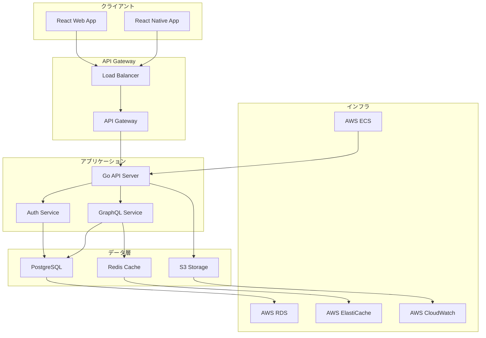
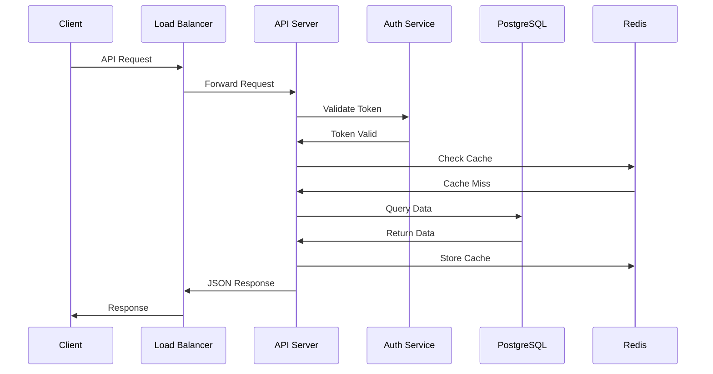
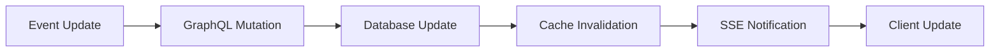

# 🏗️ アーキテクチャ設計

## 📋 アーキテクチャ概要

Morrowプロジェクトは、モダンなクラウドネイティブアーキテクチャを採用し、スケーラビリティ、可用性、保守性を重視して設計されています。

## 🎯 アーキテクチャ原則

### 1. 関心の分離
- **プレゼンテーション層**: React Native / React Web
- **API層**: Go + GraphQL
- **データ層**: PostgreSQL + Redis
- **インフラ層**: AWS + Docker

### 2. マイクロサービス指向
- **独立したサービス**: 各サービスは独立してデプロイ可能
- **API First**: GraphQL による統一されたAPIインターフェース
- **疎結合**: サービス間は明確なインターフェースで通信

### 3. スケーラビリティ
- **水平スケーリング**: コンテナベースの自動スケーリング
- **キャッシュ戦略**: Redis による高速データアクセス
- **CDN活用**: 静的リソースの配信最適化

## 🏭 システム構成図

## 🔧 技術スタック

### フロントエンド
- **React Native**: iOS/Android アプリ
- **React**: Web アプリ
- **TypeScript**: 型安全性とコード品質
- **Redux Toolkit**: 状態管理
- **Apollo Client**: GraphQL クライアント

### バックエンド
- **Go**: 高性能なAPIサーバー
- **Gin**: HTTP Web フレームワーク
- **gqlgen**: GraphQL サーバー生成
- **Ent**: ORM（Object-Relational Mapping）
- **JWT**: 認証・認可

### データベース
- **PostgreSQL**: メインデータベース
- **Redis**: キャッシュ・セッション管理
- **AWS S3**: ファイルストレージ

### インフラ
- **Docker**: コンテナ化
- **AWS ECS**: コンテナオーケストレーション
- **AWS RDS**: マネージドデータベース
- **AWS CloudFront**: CDN

## 📊 データフロー

### リクエストフロー

### データ同期フロー

## 🔒 セキュリティアーキテクチャ

### 認証・認可
- **JWT Token**: ステートレスな認証
- **OAuth 2.0**: ソーシャルログイン
- **RBAC**: ロールベースアクセス制御

### データ保護
- **暗号化**: 保存時および転送時の暗号化
- **入力検証**: すべての入力データの検証
- **レート制限**: API 呼び出しの制限

### ネットワークセキュリティ
- **HTTPS**: 全通信の暗号化
- **CORS**: クロスオリジンリクエストの制御
- **WAF**: Web Application Firewall

## 🚀 パフォーマンス最適化

### キャッシュ戦略
- **Redis**: セッション・頻繁に使用されるデータ
- **CDN**: 静的リソース（画像、CSS、JS）
- **GraphQL**: クエリレベルのキャッシュ

### データベース最適化
- **インデックス**: 高速クエリのための適切なインデックス
- **接続プール**: 効率的なデータベース接続管理
- **読み取り専用レプリカ**: 読み取り負荷の分散

### 監視・観測性
- **メトリクス**: CPU、メモリ、レスポンス時間
- **ログ**: 構造化ログによる問題の迅速な特定
- **トレーシング**: 分散トレーシングによる性能分析

## 🎯 非機能要件

### 可用性
- **SLA**: 99.9%の可用性目標
- **マルチAZ**: 複数のアベイラビリティゾーンでの冗長化
- **自動復旧**: 障害時の自動フェイルオーバー

### スケーラビリティ
- **水平スケーリング**: トラフィック増加に応じた自動スケーリング
- **垂直スケーリング**: リソース使用量に応じた動的リソース割り当て
- **負荷分散**: 複数のインスタンス間での負荷分散

### パフォーマンス
- **レスポンス時間**: API 99%ile で 200ms 以下
- **スループット**: 1秒あたり1000リクエスト処理
- **同時接続**: 10,000の同時接続サポート

## 📈 拡張性

### 水平分割
- **データベース**: 将来的なシャーディング対応
- **サービス**: 機能別マイクロサービス化
- **地理的分散**: 複数リージョンでの展開

### 機能拡張
- **プラグイン**: 新機能の追加を容易にする設計
- **API バージョニング**: 後方互換性を保った拡張
- **設定管理**: 環境別の設定管理

## 🔄 CI/CD パイプライン

### 継続的インテグレーション
- **自動テスト**: コード変更時の自動テスト実行
- **コード品質**: 静的解析とコード品質チェック
- **セキュリティ**: 依存関係の脆弱性チェック

### 継続的デプロイメント
- **段階的デプロイ**: Development → Staging → Production
- **ブルーグリーンデプロイ**: ゼロダウンタイムでの本番デプロイ
- **ロールバック**: 問題発生時の即座なロールバック

---

**関連ドキュメント**:
- [技術選定](./tech-stack.md)
- [システム設計](./system-design.md)
- [データベース設計](./database-design.md)
- [バックエンドAPI構造](./backend-api-structure.md)

**最終更新**: 2025年7月6日
