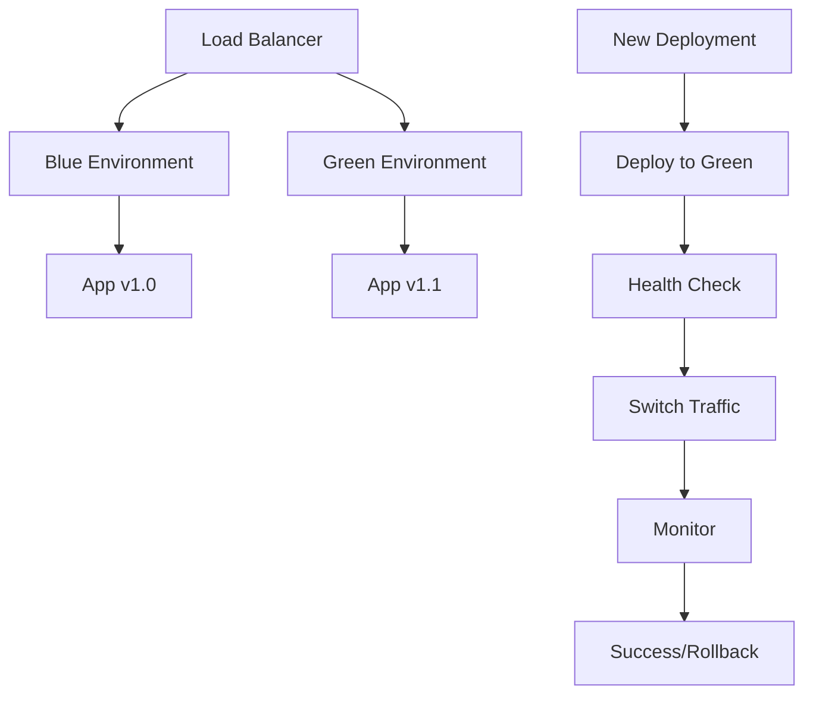

# 🚀 デプロイメント

## 📋 デプロイメント概要

Morrowプロジェクトは、コンテナベースのクラウドネイティブなデプロイメント戦略を採用しています。開発から本番まで一貫したDocker環境を使用し、AWS上で高可用性とスケーラビリティを実現します。

## 🏗️ インフラストラクチャ

### 環境構成
```
┌─────────────────┐  ┌─────────────────┐  ┌─────────────────┐
│   Development   │  │     Staging     │  │   Production    │
│                 │  │                 │  │                 │
│ Local Docker    │  │ AWS ECS Fargate │  │ AWS ECS Fargate │
│ PostgreSQL      │  │ AWS RDS         │  │ AWS RDS         │
│ Redis           │  │ AWS ElastiCache │  │ AWS ElastiCache │
│ Local Storage   │  │ AWS S3          │  │ AWS S3          │
└─────────────────┘  └─────────────────┘  └─────────────────┘
```

### AWS サービス構成
- **ECS Fargate**: コンテナオーケストレーション
- **RDS PostgreSQL**: マネージドデータベース
- **ElastiCache Redis**: マネージドキャッシュ
- **S3**: オブジェクトストレージ
- **CloudFront**: CDN
- **Route 53**: DNS管理
- **ACM**: SSL証明書管理
- **CloudWatch**: 監視・ログ

## 🔄 CI/CD パイプライン

### GitHub Actions ワークフロー
```yaml
name: CI/CD Pipeline

on:
  push:
    branches: [ main, develop ]
  pull_request:
    branches: [ main ]

jobs:
  test:
    runs-on: ubuntu-latest
    steps:
      - uses: actions/checkout@v4
      - name: Run tests
        run: |
          make test
          make lint
          make security-audit

  build:
    needs: test
    runs-on: ubuntu-latest
    steps:
      - uses: actions/checkout@v4
      - name: Configure AWS credentials
        uses: aws-actions/configure-aws-credentials@v4
        with:
          aws-access-key-id: ${{ secrets.AWS_ACCESS_KEY_ID }}
          aws-secret-access-key: ${{ secrets.AWS_SECRET_ACCESS_KEY }}
          aws-region: ap-northeast-1

      - name: Build and push Docker images
        run: |
          make build
          make push-to-ecr

  deploy-staging:
    needs: build
    runs-on: ubuntu-latest
    if: github.ref == 'refs/heads/develop'
    steps:
      - name: Deploy to Staging
        run: |
          make deploy-staging
          make smoke-test-staging

  deploy-production:
    needs: build
    runs-on: ubuntu-latest
    if: github.ref == 'refs/heads/main'
    steps:
      - name: Deploy to Production
        run: |
          make deploy-production
          make smoke-test-production
```

### パイプライン段階
1. **テスト**: 単体テスト、統合テスト、セキュリティテスト
2. **ビルド**: Dockerイメージのビルドとレジストリへのプッシュ
3. **デプロイ**: 環境別のデプロイメント
4. **検証**: デプロイ後の動作確認

## 🐳 Docker 構成

### マルチステージビルド
```dockerfile
# backend/Dockerfile
FROM golang:1.23-alpine AS builder
WORKDIR /app
COPY go.mod go.sum ./
RUN go mod download
COPY . .
RUN go build -o main cmd/server/main.go

FROM alpine:latest
RUN apk --no-cache add ca-certificates
WORKDIR /root/
COPY --from=builder /app/main .
CMD ["./main"]
```

### Docker Compose（開発環境）
```yaml
version: '3.8'
services:
  backend:
    build:
      context: ./backend
      dockerfile: Dockerfile.dev
    ports:
      - "8080:8080"
    environment:
      - DB_HOST=postgres
      - REDIS_HOST=redis
    depends_on:
      - postgres
      - redis
    volumes:
      - ./backend:/app

  frontend:
    build:
      context: ./frontend
      dockerfile: Dockerfile.dev
    ports:
      - "3000:3000"
    environment:
      - REACT_NATIVE_PACKAGER_HOSTNAME=0.0.0.0
    volumes:
      - ./frontend:/app

  postgres:
    image: postgres:15-alpine
    environment:
      POSTGRES_DB: morrow_dev
      POSTGRES_USER: morrow
      POSTGRES_PASSWORD: password
    ports:
      - "5432:5432"
    volumes:
      - postgres_data:/var/lib/postgresql/data

  redis:
    image: redis:7-alpine
    ports:
      - "6379:6379"

volumes:
  postgres_data:
```

## 🎯 デプロイメント戦略

### ブルーグリーンデプロイメント


### カナリアデプロイメント
- **5%**: 新バージョンに5%のトラフィックを流す
- **監視**: エラー率、レスポンス時間を監視
- **段階的拡大**: 問題なければ50%、100%と拡大
- **自動ロールバック**: 閾値を超えた場合の自動復旧

## 📊 監視・アラート

### CloudWatch メトリクス
```json
{
  "metrics": [
    {
      "name": "APIResponseTime",
      "unit": "Milliseconds",
      "threshold": 200
    },
    {
      "name": "ErrorRate",
      "unit": "Percent",
      "threshold": 1
    },
    {
      "name": "DatabaseConnections",
      "unit": "Count",
      "threshold": 80
    }
  ]
}
```

### アラート設定
- **エラー率**: 5分間で1%を超えた場合
- **レスポンス時間**: 99パーセンタイルで500msを超えた場合
- **CPU使用率**: 10分間で80%を超えた場合
- **データベース接続**: 接続数が上限の80%を超えた場合

## 🔧 運用ツール

### デプロイメントスクリプト
```bash
#!/bin/bash
# scripts/deploy.sh

set -e

ENVIRONMENT=$1
SERVICE=$2

if [ -z "$ENVIRONMENT" ] || [ -z "$SERVICE" ]; then
    echo "Usage: $0 <environment> <service>"
    exit 1
fi

echo "Deploying $SERVICE to $ENVIRONMENT..."

# 環境変数の設定
export AWS_REGION=ap-northeast-1
export CLUSTER_NAME=morrow-$ENVIRONMENT

# Dockerイメージのビルド
docker build -t $SERVICE:latest ./$SERVICE

# ECRへのプッシュ
aws ecr get-login-password --region $AWS_REGION | \
    docker login --username AWS --password-stdin $ECR_REGISTRY

docker tag $SERVICE:latest $ECR_REGISTRY/$SERVICE:latest
docker push $ECR_REGISTRY/$SERVICE:latest

# ECS サービスの更新
aws ecs update-service \
    --cluster $CLUSTER_NAME \
    --service $SERVICE \
    --force-new-deployment

# デプロイメントの監視
aws ecs wait services-stable \
    --cluster $CLUSTER_NAME \
    --services $SERVICE

echo "Deployment completed successfully!"
```

### ヘルスチェック
```bash
#!/bin/bash
# scripts/health-check.sh

ENDPOINT=$1
TIMEOUT=30
INTERVAL=5

if [ -z "$ENDPOINT" ]; then
    echo "Usage: $0 <endpoint>"
    exit 1
fi

echo "Checking health of $ENDPOINT..."

for i in $(seq 1 $((TIMEOUT / INTERVAL))); do
    if curl -f -s "$ENDPOINT/health" > /dev/null; then
        echo "✅ Service is healthy"
        exit 0
    fi
    echo "⏳ Waiting for service to be ready... ($i/$((TIMEOUT / INTERVAL)))"
    sleep $INTERVAL
done

echo "❌ Service health check failed"
exit 1
```

## 🔒 セキュリティ

### 本番環境でのセキュリティ対策
- **VPC**: プライベートネットワーク
- **Security Groups**: 最小権限原則
- **IAM Roles**: 適切な権限設定
- **Secrets Manager**: 機密情報の管理
- **WAF**: Web Application Firewall

### 証明書管理
```bash
# SSL証明書の自動更新
aws acm request-certificate \
    --domain-name api.morrow.app \
    --validation-method DNS \
    --subject-alternative-names "*.morrow.app"
```

## 🎯 パフォーマンス最適化

### 自動スケーリング
```json
{
  "scalingPolicy": {
    "targetCapacity": {
      "min": 2,
      "max": 10,
      "desired": 3
    },
    "scalingTriggers": [
      {
        "metric": "CPUUtilization",
        "threshold": 70,
        "scaleOutCooldown": 300,
        "scaleInCooldown": 600
      },
      {
        "metric": "RequestCount",
        "threshold": 1000,
        "scaleOutCooldown": 180,
        "scaleInCooldown": 300
      }
    ]
  }
}
```

### CDN設定
```yaml
# CloudFront設定
distributions:
  - domain: cdn.morrow.app
    origins:
      - domain: api.morrow.app
        path: /static
    behaviors:
      - path: "*.js"
        cache_policy: "managed-caching-optimized"
      - path: "*.css"
        cache_policy: "managed-caching-optimized"
      - path: "*.png"
        cache_policy: "managed-caching-optimized"
```

## 🔄 災害復旧

### バックアップ戦略
- **RDS**: 自動バックアップ（7日間保持）
- **S3**: クロスリージョンレプリケーション
- **設定**: Infrastructure as Code によるバージョン管理

### 復旧手順
1. **障害検知**: 監視システムによる自動検知
2. **影響範囲確認**: 被害状況の把握
3. **復旧作業**: 自動/手動での復旧実行
4. **動作確認**: サービスの正常動作確認
5. **事後対応**: 障害原因の分析と対策

---

**関連ドキュメント**:
- [CI/CD設定](./ci-cd.md)
- [インフラ構成](./infrastructure.md)
- [監視・運用](./monitoring.md)
- [アーキテクチャ設計](../04-architecture/README.md)

**最終更新**: 2025年7月6日
